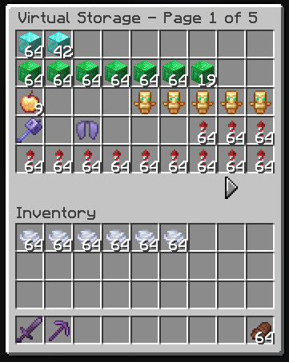

#  Virtual Storage

---

This **server-side** mod allows each player to access a private virtual storage to store their items.  



This mod supports polymer resource packs to provide a nicer UI.

## Configuration

To configure this mod, a `virtual-storage.properties` file must be placed in the `config` directory.  
Configuration example:

```properties
storage=mariadb
host=192.168.1.1
port=3306
database=virtual_storage
user=user
password=password
```

The list of supported databases can be found [here](https://modrinth.com/mod/database-utils).

## Commands

The main command is `virtual-storage`. The following sub-commands are available.  

| Sub-command                              | Description                                                |                Permissions |
|:-----------------------------------------|:-----------------------------------------------------------|---------------------------:|
| open                                     | Open your storage.                                         |      `virtualstorage.open` |
| open `[page]`                            | Open your storage on the given page.                       | `virtualstorage.open.page` |
| admin open `[player]`                    | Open the storage of the given player.                      |     `virtualstorage.admin` |
| admin clear `[player]`                   | Clear the storage of the given player.                     |     `virtualstorage.admin` |
| admin max_page `[player]` set `[number]` | Set the maximum number of pages for the given player.      |     `virtualstorage.admin` |
| admin max_page `[player]` increment      | Increment the maximum number of pages of the given player. |     `virtualstorage.admin` |
